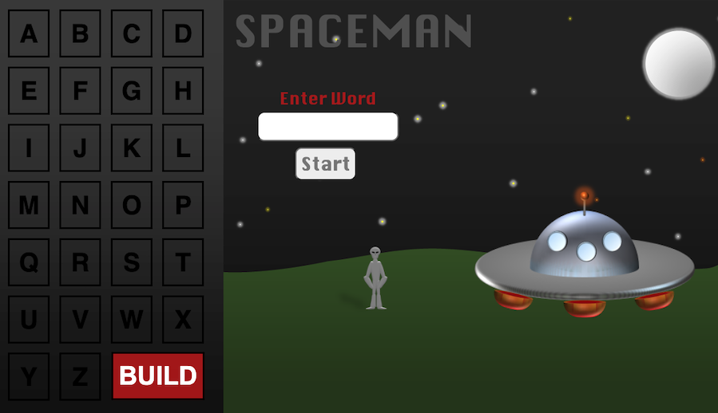
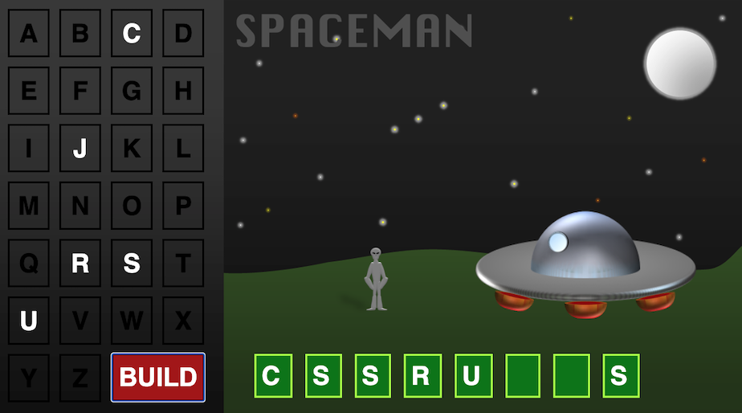

# Spaceman

## Background
Game: Spaceman
I wanted to make a game that can also be used as a digital teaching tool. Teachers can use Spaceman in their classrooms to strengthen student's skills, in this case, vocabulary skills. I have always liked Hangman but this term is culturally insensitive and is a problematic name. After researching Spaceman which is an alternative to Hangman but functions the same way, I found out that the rename of this vocabulary game was popularized by a teacher. Since then, various other teachers have used the PowerPoint presentation that he made to play this game. I wanted to use his original art to make it a web browser game to make it more efficient to play. Original images can be downloaded and found here: https://tekhnologic.wordpress.com/2017/03/01/spaceman-an-alternative-to-hangman/    

## Wireframe & Screenshot of Game

### Technologies Used
-JavaScript

-HTML

-CSS

-Microsoft PowerPoint

#### Game
Link to the game: [Spaceman](https://romanamaralit.github.io/spaceman/)

**Instructions:**
Spaceman is a two or more player game. One player thinks of a word and enter it in the text box and the other tries to guess it one letter at a time. The guesser has nine tries to guess the word!

#### Next Steps
I would like to add more CSS styling to the game like a style over the letters when you hover over them. I would also like the transition between the game the the winning and losing pages to be smoother. 
