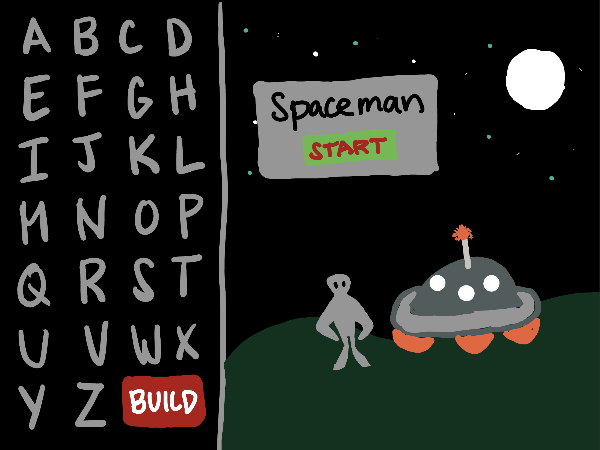

# Spaceman

## Background
-Game Choice: Spaceman
    I wanted to make a game that can also be used as a digital teaching tool. Teachers can use Spaceman in their classrooms to strengthen student's skills, in this case, vocabulary skills. I have always liked Hangman but this term is culturally insensitive and is a problematic name. After researching Spaceman which is an alternative to Hangman but functions the same way, I found out that it was created by a teacher and since then, various other teachers have used the PowerPoint presentation that he made to play this game. I wanted to use his original art to make it a web browser game to make it more efficient to play.

## Wireframe



### PseudoCode
```
function changePlayerTurn(){
  - check who is current player
  - switch from player 1 to player 2
  - run function for next action in game
}
```


