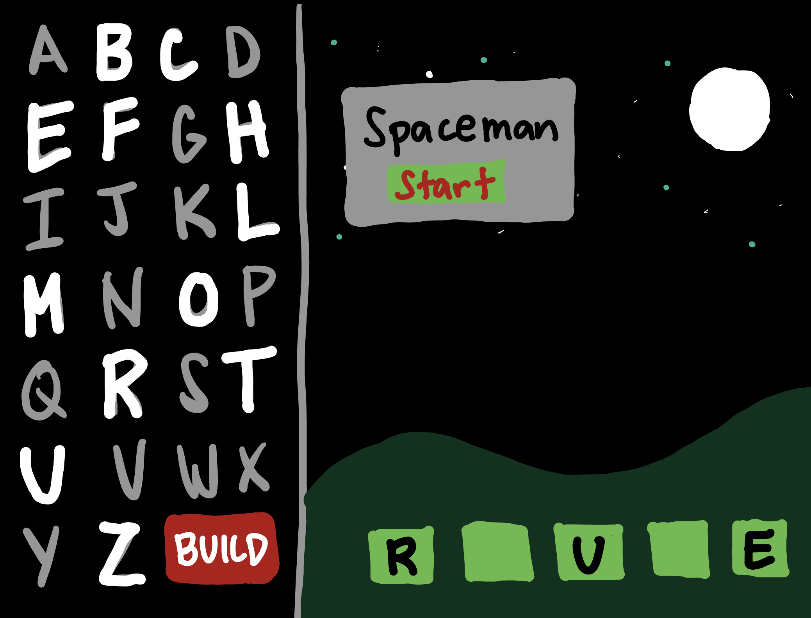

# Spaceman

## Background
-Game Choice: Spaceman
    I wanted to make a game that can also be used as a digital teaching tool. Teachers can use Spaceman in their classrooms to strengthen student's skills, in this case, vocabulary skills. I have always liked Hangman but this term is culturally insensitive and is a problematic name. After researching Spaceman which is an alternative to Hangman but functions the same way, I found out that the rename of this vocabulary game was popularized by a teacher. Since then, various other teachers have used the PowerPoint presentation that he made to play this game. I wanted to use his original art to make it a web browser game to make it more efficient to play. Original images can be downloaded and found here: https://tekhnologic.wordpress.com/2017/03/01/spaceman-an-alternative-to-hangman/


## Wireframe




### PseudoCode
```
/*----- constants -----*/
const startButton = start button
const inputBox = input
const letters = letters on the black left side
const lettersGuessed = letters on the bottom right side
const shipParts = 7 parts of the ship
const buildButton = build button
const playAgainButton = play again button

/*----- event listeners -----*/
startButton.addEventListener
buildButton.addEventListener
playAgainButton.addEventListener
input just takes in values

/*----- functions -----*/	
Landing rendered page: 
-All elements of the game, present (but spaceship is hidden but still there)
-Start button present
-Things not present: box to enter word to guess and play again button

    -function startGame: user clicks on start button
        -function startButtonOff: button goes away
        -function enterText: user inputs a text but is crypted, press enter
            -function storeWord: word from input is stored somehow in the boxes
                -function hideLetter: letters from storeword is same green as boxes so it hides the letters
        -function ship: all ship parts go away
        
    -function guessWord: user clicks on a letter on the left black side
        -function correctLetter: 
            -if correct, reveal letter(s) on green right side. Keep them revealed (make the letters go from green to black)
            -else if correct and completes the word, game ends go to gameOver
            -else, start bulding the ship
                -function buildShip: user clicks on build
                -function sevenClicks: the 9th click finishes the spaceship, game ends go to gameOver
    *this function gets called again and again everytime a letter on the lext black side is clicked

    -function gameOver: all 9 parts of the ship goes away including alien
        -function ship: all ship parts go away
        -function playAgain: play again button comes up and returns the state of the game to startButtonOff

/*----- html content -----*/
-images:
    -galaxy image background
        -inside this image:
            -alien
            -ring
            -engine1, engine2, engine3
            -dome
            -window1, window2, window3
            -antenna
            Non images:
            -start button
            -play again button
            -grid for letters
            -grid for guessed letters
            -build button  
            Additional pop up:
            -Enter word to guess box maybe input
```


